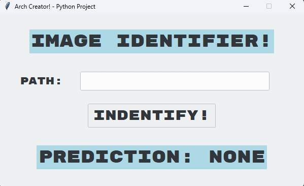

# 🖼️ Image Identifier!



## Features

- Classifies images into: **Fish, Dog, Cat, Snake, Bird, Butterfly,** or **Unknown**
- Invalid path detection with animated error label
- Spam prevention with button cooldown
- Clean GUI built with tkinter and ttkthemes

## Technologies Used

- Python
- PyTorch (ResNet18)
- Pillow
- tkinter / ttkthemes

## How to Run

1. Install dependencies:
```
   pip install torch torchvision pillow ttkthemes
```
2. Run the script:
```
   python main.py
```
3. Enter the path to an image and click **Identify!**

## Required Files

- `main.py`
- `Rubik_Mono_One` font installed on your system

## Notes

- Place your images in the **same directory** as `main.py` and enter just the filename (e.g. `cat.jpg`) as the path
- Supported categories are based on ImageNet classes via ResNet18

## Author

**AlexIsNotInset**
